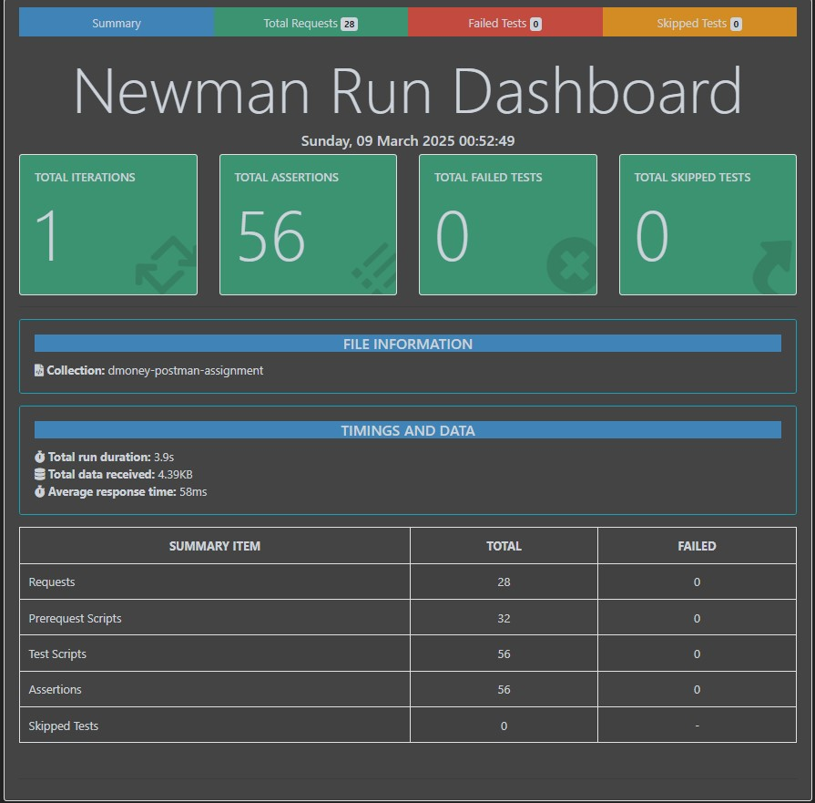

# Demo Financial User management

## Description: By this demo API project named dmoney, we can create and manipulate several types of user roles like Customer, Agent, and Merchant

## Technology I used:

- Postman
- Newman
- Report: newman-html-extra

## How to run?

- Clone this project
- Collect .env from developer and put it in the source root folder
- Hit the following command:

> npm i

> npm test

- Report will be generated in the Reports folder!

# Test Case Report

- <a href="https://docs.google.com/spreadsheets/d/1PPquhYZzaqhdaYx7eB6gYVClCHqwadxo/edit?usp=sharing&ouid=100285197147699236704&rtpof=true&sd=true">Click Here to test case</a>

## Postman Documentation

- <a href="https://documenter.getpostman.com/view/39989719/2sAYdoFSkX">Click Here</a>

## Bug Report

- <a href="https://docs.google.com/spreadsheets/d/1GTYgJWEhvlxdzxaHZxXKksVlI5AHAVae/edit?usp=sharing&ouid=100285197147699236704&rtpof=true&sd=true">Click Here to see bug report</a>

## Test Report

